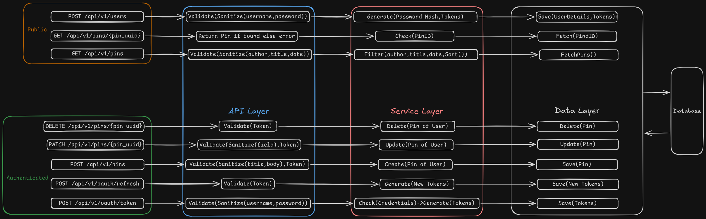
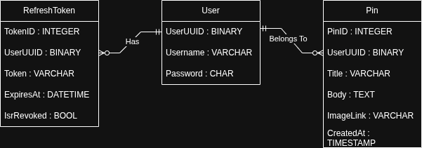

# API Design Documentation for a Simple CRUD Endpoint with OAuth

## Auth Endpoints

Includes registering a user as well as obtaining and renewing access/refresh tokens.


### Register a user
**Endpoint:** `POST /api/v1/users`
**Description:** Registers a new user and provides an auth token. This endpoint is public.

**Headers:**
* None required

**Request Body:**
```json
{
"username":{username},
"password":{password}
}
```

**Expected Response (201 Created):**
```json
{
"user_id": {UUID},
"access_token": {access token},
"refresh_token": {refresh token},
"expires_at": {expiry timestamp}
}
```

**Error Responses:**
* `400 Bad Request`: If invalid or incomplete fields are given.
* `409 Conflict`: User already exists.

---

### Obtain a pair of Access and Refresh Tokens
**Endpoint:** `POST /api/v1/oauth/token`
**Description:** Obtains a pair of Access and Refresh Tokens. This endpoint is for valid registered users.

**Headers:**
* `Content-Type: application/json`

**Request Body:**
```json
{
"username":{username},
"password":{password}
}
```

**Expected Response (200 OK):**
```json
{
"access_token":{JWT access token},
"refresh_token":{refresh token},
"expires_in":{seconds},
"token_type": "Bearer"
}
```

**Error Responses:**
* `401 Unauthorized - Invalid Grant`: Username and Password combination is invalid.

---

### Obtain a new/renew the pair of Access and Refresh Tokens
**Endpoint:** `POST /api/v1/oauth/refresh`
**Description:** Obtains a new or renew the pair of Access and Refresh Tokens. This endpoint is for valid registered users.

**Headers:**
* `Content-Type: application/json`

**Request Body:**
```json
{
"refresh_token":{refresh token}
}
```

**Expected Response (200 OK):**
```json
{
"access_token":{new JWT access token},
"refresh_token":{new refresh token},
"expires_in":{seconds},
"token_type": "Bearer"
}
```

**Error Responses:**
* `401 Unauthorized - Invalid Grant`: Invalid or revoked refresh token given.

---

## CRUD Endpoints

Main functionality of this API


### Create a Pin
**Endpoint:** `POST /api/v1/pins`
**Description:** Creates a new pin. Authenticated endpoint.

**Headers:**
* `Authorization: Bearer {token}`
* `Content-Type: application/json`

**Request Body:**
```json
{
"title":{title},
"body":{body},
"image_link":{image link}
}
```

**Expected Response (201 Created):**
```json
{
"pin_id": {id},
"author": {username},
"title":{title},
"body":{body},
"image_link":{image link},
"created_at":{timestamp}
}
```

**Error Responses:**
* `400 Bad Request`: Incomplete or invalid fields.
* `422 Unprocessable Entity`: Validation Error.

---

### Get a Specific Pin
**Endpoint:** `GET /api/v1/pins/{pin_id}`
**Description:** Retrieves the details of a single pin by its ID. This endpoint is public.

**Path Parameters:**
* `pin_id` (string, required): The unique identifier of the pin.

**Headers:**
* None required.

**Expected Response (200 OK):**
```json
{
  "pin_id": {id},
  "author": {username},
  "title": {title},
  "body": {body},
  "image_link": {image link},
  "created_at": {timestamp}
}
```

**Error Responses:**
* `404 Not Found`: If the pin_id does not exist.

---

### Get a List of Pins with Optional Filtering
**Endpoint:** `GET /api/v1/pins`
**Description:** Retrieves a list of pins with optional filtering capabilities. This endpoint is public.

**Path Parameters:**
* `author` (string, optional): Filter pins by specific author.
* `title` (string, optional): Filter pins by title.
* `created_at` (date, optional): Filter pins by date.
* `order`, `sort_by` (string, optional): Filter pins by descending or ascending order based on sorting order [title, author, created_at] (default created_at).

**Headers:**
* None required.

**Expected Response (200 OK):**
```json
{
"pins": [
    {
        "pin_id": {id},
        "author": {username},
        "title": {title},
        "body": {body},
        "image_link": {image link},
        "created_at": {timestamp}
    }
]
}
```

**Error Responses:**
* `400 Bad Response`: Invalid structured query.

---

### Update a Pin
**Endpoint:** `PATCH /api/v1/pins/{pin_id}`
**Description:** Updates a specific pin associated with a user. Endpoint is Authenticated and one user cannot modify other user's pin.

**Path Parameters:**
* `pin_id` (string, required): The unique identifier of the pin.

**Headers:**
* `Authorization: Bearer <access_token>`
* `Content-Type: application/json`
* `Accept: application/json`

**Request Body:**
```json
{
"title":{new title}
}
```

**Expected Response (200 OK):**
```json
{
    "pin_id": {id},
    "author": {username},
    "title": {new title},
    "body": {body},
    "image_link": {image link},
    "created_at": {timestamp}
}
```

**Error Responses:**
* `400 Bad Response`: Invalid structured query.
* `401 Unathorized`: No token given in the header.
* `403 Forbidden`: Valid token but pin belongs to someone else.
* `404 Not Found`: Missing pin/invalid pin ID.
* `422 Unprocessable Entity`: A field validation error.

---

### Delete a Pin
**Endpoint:** `DELETE /api/v1/pins/{pin_id}`
**Description:** Deletes a specific pin associated with a user. Endpoint is Authenticated and one user cannot delete other user's pin.

**Path Parameters:**
* `pin_id` (string, required): The unique identifier of the pin.

**Headers:**
* `Authorization: Bearer <access_token>`
* `Accept: application/json`

**Expected Response (204 No Content):**

**Error Responses:**
* `401 Unathorized`: No token given in the header.
* `403 Forbidden`: Valid token but pin belongs to someone else.
* `404 Not Found`: Missing pin/invalid pin ID.

---

## Diagrams

### API Architecture Diagram




### Entity Relationship Diagram


